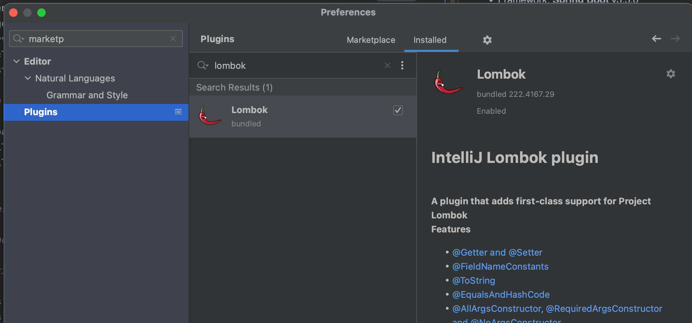
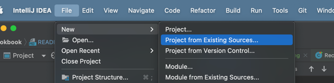
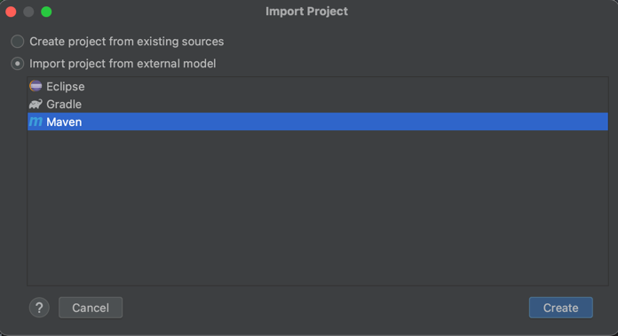
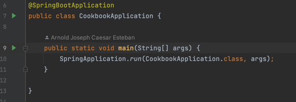
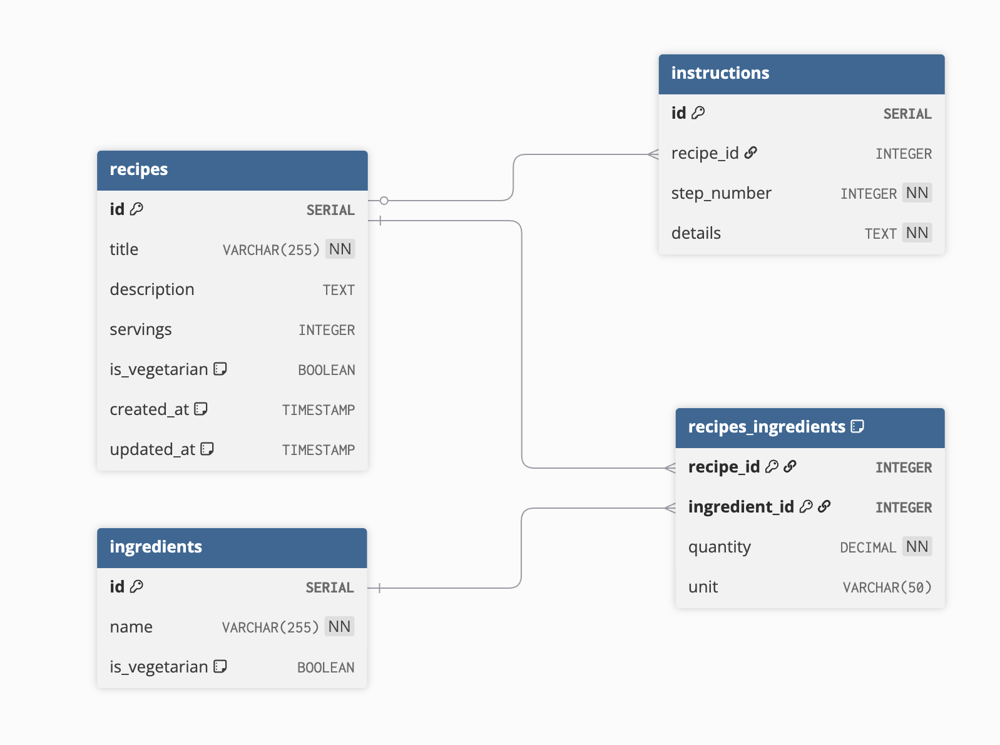
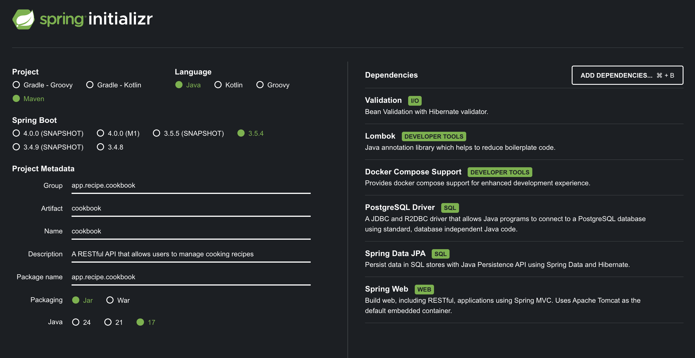

# Cookbook

# **📘**Overview

Cookbook is a **RESTful API** using **Java Spring Boot** that allows users to manage cooking recipes. Each recipe includes a title, description, ingredients, and instructions. The system supports basic CRUD operations and a search feature.

## **🛠️ Technical Requirements**

- Framework: **Spring Boot** v3.5.0
- Language: **Java** 17
- Persistence framework: **JPA/Hibernate** with PostgreSQL 14.17
- Convenience Library: Use Project Lombok
- Build Tool: Use Maven
- Follows **REST principles**

## **✅ Features**


### **RESTful API Endpoints**

- Implement all CRUD operations:
    - Create, Read, Update, Delete a recipe.
- Implement a **search endpoint** with optional query filters:
    - Vegetarian filter
    - Servings filter
    - Include/exclude ingredients
    - Instruction content search

### Setup Instructions

1. Clone this repository to your machine.
2. Download Java 17 (Can be downloaded through [SDKMan](https://sdkman.io/))
2. Install IntelliJ
3. Install Lombok Plugin in IntelliJ
4. 
5. Import the project using "Project from existing sources".
6. 
7. Select Maven and click Create button
8. 
9. Application can be run by clicking
10. 
10. REST Documentation can be found in the following
* Swagger UI: http://localhost:8080/swagger-ui.html
* OpenAPI JSON: http://localhost:8080/api-docs


# **🔎 Design Choices**

## Implementation Approach

### Functional Requirements

- [ ]  As a user, I should be able to create a recipe
- [ ]  As a user, I should be able to update a recipe
    - [ ]  What fields are updateable?
- [ ]  As a user, I should be able to read a recipe
- [ ]  As a user, I should be able to delete a recipe
    - [ ]  Ingredients might stay, as it can be linked to other recipes
        - [ ]  If ingredient is not linked anymore to other recipe, should we delete it?
- [ ]  As a user, I should be able to look / search for recipes
    - [ ]  List all
    - [ ]  List those that are vegetarian
    - [ ]  List depending on serving size
    - [ ]  List those with certain ingredients (include / exclude option)
        - [ ]  Can include and exclude co-exist?
            - [ ]  If yes, what’s the order? I’m assuming include will list all recipes that have the ingredient(s) and then exclude filter will remove those recipes from the list if ANY of the ingredient mentioned in the exclude filter
    - [ ]  List all inclusion content search
        - [ ]  I am assuming this is a simple text search for now
            - [ ]  More complex (NLP based) requires some other data store like ElasticSearch or it could be PostgreSQL itself [https://www.postgresql.org/docs/current/datatype-textsearch.html](https://www.postgresql.org/docs/current/datatype-textsearch.html).
                - [ ]  NLP might be limited to certain language only. Which is why this is very tricky one.
                - [ ]  Instruction may need to be added as multi-language? not for now
                - [ ]  Out of scope for now.


### Assumptions

* Recipe being "vegetarian" is user input driven, and based on ingredients (derived field)

### Anatomy of a Recipe


#### Recipe
* 🌾Recipe has servings (number of people who can eat)
* Recipe has name (usually not unique) 🤷 
* Recipe has description 
* Recipe has serving size 
* Recipe can have 1 to many ingredients 
* Recipe can have 1 to many steps / instructions, steps also contain ingredient btw. Instructions need to be in order!
* What makes a recipe “vegetarian”? It is on the ingredients right? Should the flag be in recipe or in ingredient? If in recipe, is it a computed value or predefined? 
* Identifier: UUID |

#### Ingredient
* Ingredient usually has name and quantity to it 
* Ingredient can be part of 1 to many recipe 
* Since recipe has servings, ingredient should be measurable:
  * quantity 
  * unit (unit type: metric, imperial): we can convert everything to 1 unit type, however it doesn’t make sense to enforce  for certain recipes (some are better of using either type - loss in conversion)
* ingredient itself will dictate if the recipe is vegetarian 
* Identifier: UUID

#### Instruction
* Assuming instruction is solely for the recipe, not shared to other recipes. 
* I assume not to have translations here, just placed as is. 
* It can be “displayed” as a sentence containing the ingredient. (linked as placeholder)
  * Out of scope for now
* Identifier: UUID


### Recipe Search & Filter Logic - Business Overview

### Search Functionality
The recipe search system allows users to find recipes using multiple filter criteria that work together.  
Users can search by dietary preferences:
* vegetarian/non-vegetarian
* serving sizes (exact number or range)
* specific ingredients they want included
* ingredients they want to avoid
* text within cooking instructions.


* The system is designed to be flexible
  * users can apply just one filter for simple searches or combine multiple filters for more precise results. For example, a user could search for "vegetarian recipes for 4 people that include pasta but exclude nuts."

### Filter Logic & Business Rules
* The ingredient filters use intuitive logic:
  * "include ingredients" means the recipe must contain all specified ingredients
    * (like requiring both eggs AND milk),
  * "exclude ingredients" means the recipe cannot contain any of the specified ingredients
    * (like avoiding both pork OR beef).
* The system validates that users
  * don't create contradictory searches
    * like including and excluding the same ingredient
  * ensures serving size ranges make sense
    * minimum can't be greater than maximum


### Database Schema

```sql
-- Recipe Table
CREATE TABLE recipes (
    id UUID PRIMARY KEY DEFAULT gen_random_uuid(),
    title VARCHAR(255) NOT NULL,
    description TEXT,
    servings INTEGER NOT NULL CHECK (servings > 0),
    is_vegetarian BOOLEAN DEFAULT FALSE,
    created_at TIMESTAMP DEFAULT CURRENT_TIMESTAMP,
    updated_at TIMESTAMP DEFAULT CURRENT_TIMESTAMP
);

-- Ingredient Table
CREATE TABLE ingredients (
    id UUID PRIMARY KEY DEFAULT gen_random_uuid(),
    name VARCHAR(255) NOT NULL UNIQUE,
    is_vegetarian BOOLEAN DEFAULT FALSE
);

-- Recipe_Ingredient Table (Join table with measurement details)
-- NOTE: Can even have a lookup table, but used this for now for simplicity
CREATE TABLE recipes_ingredients (
    recipe_id UUID REFERENCES recipe(id) ON DELETE CASCADE,
    ingredient_id UUID REFERENCES ingredients(id),
    quantity DECIMAL NOT NULL CHECK (quantity > 0),
    unit VARCHAR(50)
    PRIMARY KEY (recipe_id, ingredient_id)
);

-- Instruction Table
CREATE TABLE instructions (
    id UUID PRIMARY KEY DEFAULT gen_random_uuid(),
    recipe_id UUID REFERENCES recipes(id) ON DELETE CASCADE,
    step_number INTEGER NOT NULL CHECK (step_number > 0),
    content TEXT NOT NULL
    UNIQUE (recipe_id, step_number)
);

-- Instruction_Ingredient Table (to track ingredients used in specific steps)
-- NOTE: not supported for now
/*
CREATE TABLE instructions_ingredients (
    instruction_id UUID REFERENCES instructions(id) ON DELETE CASCADE,
    ingredient_id UUID REFERENCES ingredients(id),
    created_at TIMESTAMP DEFAULT CURRENT_TIMESTAMP,
    updated_at TIMESTAMP DEFAULT CURRENT_TIMESTAMP,
    PRIMARY KEY (instruction_id, ingredient_id)
);
*/

-- Create indexes for better query performance
CREATE INDEX idx_recipe_vegetarian ON recipes(is_vegetarian);
CREATE INDEX idx_recipe_servings ON recipes(servings);
CREATE INDEX idx_ingredient_vegetarian ON ingredients(is_vegetarian);
CREATE INDEX idx_instruction_content ON instructions USING gin(to_tsvector('english', content));

```

This schema implements the recipe management system with UUID identifiers as specified in the requirements. It includes:

- The **recipes** table with servings and vegetarian flag
- The **ingredient**s table with vegetarian status
- A many-to-many relationship between recipes and ingredients with quantity and unit information
- Ordered instructions with step numbers
- Proper constraints and indexes to support the filtering requirements

### ERD



[https://dbdiagram.io/d/Cookbook-Recipe-Manager-688ce44fcca18e685cdd43be](https://dbdiagram.io/d/Cookbook-Recipe-Manager-688ce44fcca18e685cdd43be)

## Setting up the application

1. Go to [start.spring.io](https://start.spring.io/)
2. Use the following setup:



### Common framework strategy:

- Find a way to handle exceptions in a format that is uniform
- (Use Exception Mappers from Jersey/Dropwizard, probably `@ExceptionHandler` and `@RestControllerAdvice` is it’s equivalent
- Have a good folder structure:

```
src/package/root/
    common/ --> common config goes here
    recipe/ --> recipe is a "domain". Group values by domain
```

### Testing

* Apply unit tests
* (Ran out of time) implement integration test using Test Containers
  * Only test happy paths in integration test, edge cases must be tested on functional (business logic) test

### Known issues
* On update, we can't change the isVegetarian field value.
* Instruction content search is currently case-sensitive.